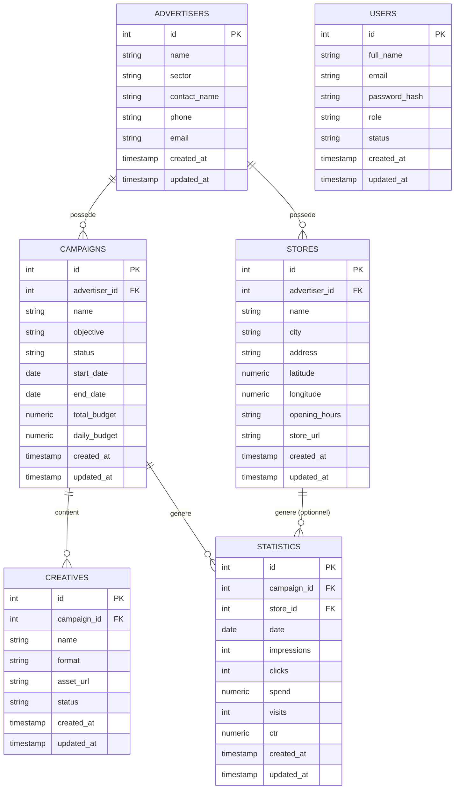

# Schéma de la base de données — SBS Data Factory · Drive-to-Store DSP

> Document de référence pour la base de données PostgreSQL de la plateforme.
> Il accompagne le fichier de migration
> [`database/migrations/001_initial_schema.sql`](../database/migrations/001_initial_schema.sql).

## 1. Contexte

La plateforme **Drive-to-Store DSP** permet à des **annonceurs** de créer et
suivre des **campagnes publicitaires** dont l'objectif est de générer des
**visites en magasin**. Chaque campagne diffuse une ou plusieurs **créatives**
(visuels publicitaires) et génère quotidiennement des **statistiques de
performance** (impressions, clics, dépense, visites…), globales ou par
magasin.

Ce document décrit le schéma **initial** de la base de données, correspondant
à la fin de la Semaine 2 du projet. Le frontend (React) et l'API (FastAPI)
utilisent actuellement des **données mockées** ; ce schéma prépare le passage
à une vraie base PostgreSQL, sans dépendre de la façon dont le frontend est
construit.

## 2. Objectif de la base de données

- Stocker de façon fiable les données métier de la plateforme : utilisateurs,
  annonceurs, campagnes, magasins, créatives et statistiques.
- Garantir la cohérence des données grâce à des clés primaires/étrangères et
  des contraintes (valeurs autorisées, montants positifs, dates cohérentes…).
- Fournir une base de reporting performante (index sur les colonnes les plus
  filtrées : annonceur, campagne, date).
- Servir de socle versionné (fichier de migration SQL) pour que l'évolution
  du schéma soit traçable dans Git, au même titre que le code applicatif.

## 3. Liste des tables

| Table          | Rôle                                                              |
| -------------- | ------------------------------------------------------------------ |
| `users`        | Comptes de la plateforme (rôle admin / media_buyer / lecteur)    |
| `advertisers`  | Annonceurs (clients) pour lesquels les campagnes sont créées      |
| `campaigns`    | Campagnes publicitaires Drive-to-Store                            |
| `stores`       | Magasins (points de vente) d'un annonceur                         |
| `creatives`    | Visuels / assets publicitaires diffusés par une campagne          |
| `statistics`   | Statistiques quotidiennes de performance par campagne / magasin   |

## 4. Détail des colonnes

### 4.1 `users`

| Colonne          | Type          | Contraintes                                         | Description                          |
| ---------------- | ------------- | ---------------------------------------------------- | ------------------------------------- |
| `id`              | `SERIAL`       | `PRIMARY KEY`                                         | Identifiant unique                   |
| `full_name`       | `VARCHAR(150)` | `NOT NULL`                                            | Nom complet de l'utilisateur          |
| `email`           | `VARCHAR(255)` | `NOT NULL`, `UNIQUE`                                  | Adresse email (identifiant de connexion) |
| `password_hash`   | `VARCHAR(255)` | `NOT NULL`                                            | Mot de passe **haché** (jamais en clair) |
| `role`            | `VARCHAR(20)`  | `NOT NULL`, défaut `lecteur`, valeurs limitées        | `admin`, `media_buyer` ou `lecteur`   |
| `status`          | `VARCHAR(20)`  | `NOT NULL`, défaut `active`, valeurs limitées         | `active`, `invited` ou `disabled`     |
| `created_at`      | `TIMESTAMPTZ`  | `NOT NULL`, défaut `now()`                            | Date de création                      |
| `updated_at`      | `TIMESTAMPTZ`  | `NOT NULL`, défaut `now()`, mis à jour automatiquement | Date de dernière modification        |

### 4.2 `advertisers`

| Colonne          | Type          | Contraintes                 | Description                     |
| ---------------- | ------------- | ---------------------------- | -------------------------------- |
| `id`              | `SERIAL`       | `PRIMARY KEY`                 | Identifiant unique               |
| `name`            | `VARCHAR(150)` | `NOT NULL`                    | Nom de l'annonceur                |
| `sector`          | `VARCHAR(120)` |                               | Secteur d'activité                |
| `contact_name`    | `VARCHAR(150)` |                               | Nom du contact principal          |
| `phone`           | `VARCHAR(30)`  |                               | Téléphone du contact              |
| `email`           | `VARCHAR(255)` |                               | Email du contact                  |
| `created_at`      | `TIMESTAMPTZ`  | `NOT NULL`, défaut `now()`    | Date de création                  |
| `updated_at`      | `TIMESTAMPTZ`  | `NOT NULL`, défaut `now()`    | Date de dernière modification     |

### 4.3 `campaigns`

| Colonne          | Type            | Contraintes                                                   | Description                          |
| ---------------- | --------------- | ---------------------------------------------------------------- | -------------------------------------- |
| `id`              | `SERIAL`         | `PRIMARY KEY`                                                     | Identifiant unique                    |
| `advertiser_id`   | `INTEGER`        | `NOT NULL`, `FOREIGN KEY → advertisers(id)`, `ON DELETE CASCADE`  | Annonceur propriétaire de la campagne |
| `name`            | `VARCHAR(180)`   | `NOT NULL`                                                        | Nom de la campagne                    |
| `objective`       | `VARCHAR(30)`    | `NOT NULL`, défaut `drive_to_store`, valeurs limitées             | Objectif publicitaire                 |
| `status`          | `VARCHAR(20)`    | `NOT NULL`, défaut `draft`, valeurs limitées                      | `active`, `paused`, `draft`, `completed` |
| `start_date`      | `DATE`           |                                                                    | Date de début                         |
| `end_date`        | `DATE`           | doit être ≥ `start_date`                                          | Date de fin                           |
| `total_budget`    | `NUMERIC(12,2)`  | `NOT NULL`, défaut `0`, `≥ 0`                                     | Budget total                          |
| `daily_budget`    | `NUMERIC(12,2)`  | `NOT NULL`, défaut `0`, `≥ 0`                                     | Budget quotidien                      |
| `created_at`      | `TIMESTAMPTZ`    | `NOT NULL`, défaut `now()`                                        | Date de création                      |
| `updated_at`      | `TIMESTAMPTZ`    | `NOT NULL`, défaut `now()`                                        | Date de dernière modification         |

### 4.4 `stores`

| Colonne          | Type            | Contraintes                                                   | Description                       |
| ---------------- | --------------- | ---------------------------------------------------------------- | ----------------------------------- |
| `id`              | `SERIAL`         | `PRIMARY KEY`                                                     | Identifiant unique                 |
| `advertiser_id`   | `INTEGER`        | `NOT NULL`, `FOREIGN KEY → advertisers(id)`, `ON DELETE CASCADE`  | Annonceur propriétaire du magasin  |
| `name`            | `VARCHAR(180)`   | `NOT NULL`                                                        | Nom du magasin                     |
| `city`            | `VARCHAR(120)`   |                                                                    | Ville                              |
| `address`         | `VARCHAR(255)`   |                                                                    | Adresse complète                   |
| `latitude`        | `NUMERIC(9,6)`   |                                                                    | Latitude GPS                       |
| `longitude`       | `NUMERIC(9,6)`   |                                                                    | Longitude GPS                      |
| `opening_hours`   | `VARCHAR(255)`   |                                                                    | Horaires d'ouverture (texte libre) |
| `store_url`       | `VARCHAR(255)`   |                                                                    | Lien vers la fiche magasin / site  |
| `created_at`      | `TIMESTAMPTZ`    | `NOT NULL`, défaut `now()`                                        | Date de création                   |
| `updated_at`      | `TIMESTAMPTZ`    | `NOT NULL`, défaut `now()`                                        | Date de dernière modification      |

### 4.5 `creatives`

| Colonne          | Type            | Contraintes                                                 | Description                        |
| ---------------- | --------------- | -------------------------------------------------------------- | ------------------------------------- |
| `id`              | `SERIAL`         | `PRIMARY KEY`                                                   | Identifiant unique                    |
| `campaign_id`     | `INTEGER`        | `NOT NULL`, `FOREIGN KEY → campaigns(id)`, `ON DELETE CASCADE`  | Campagne propriétaire de la créative  |
| `name`            | `VARCHAR(180)`   | `NOT NULL`                                                      | Nom de la créative                    |
| `format`          | `VARCHAR(20)`    | `NOT NULL`, défaut `image`, valeurs limitées                    | `image`, `html5` ou `video`           |
| `asset_url`       | `VARCHAR(255)`   |                                                                  | Lien vers le fichier / visuel         |
| `status`          | `VARCHAR(20)`    | `NOT NULL`, défaut `draft`, valeurs limitées                    | `draft`, `active`, `paused`, `archived` |
| `created_at`      | `TIMESTAMPTZ`    | `NOT NULL`, défaut `now()`                                      | Date de création                      |
| `updated_at`      | `TIMESTAMPTZ`    | `NOT NULL`, défaut `now()`                                      | Date de dernière modification         |

### 4.6 `statistics`

| Colonne          | Type            | Contraintes                                                  | Description                                    |
| ---------------- | --------------- | ----------------------------------------------------------------| ------------------------------------------------- |
| `id`              | `SERIAL`         | `PRIMARY KEY`                                                    | Identifiant unique                              |
| `campaign_id`     | `INTEGER`        | `NOT NULL`, `FOREIGN KEY → campaigns(id)`, `ON DELETE CASCADE`   | Campagne concernée                              |
| `store_id`        | `INTEGER`        | **nullable**, `FOREIGN KEY → stores(id)`, `ON DELETE SET NULL`   | Magasin concerné (optionnel)                    |
| `date`            | `DATE`           | `NOT NULL`                                                       | Jour mesuré                                     |
| `impressions`     | `INTEGER`        | `NOT NULL`, défaut `0`, `≥ 0`                                    | Nombre d'affichages                             |
| `clicks`          | `INTEGER`        | `NOT NULL`, défaut `0`, `≥ 0`                                    | Nombre de clics                                 |
| `spend`           | `NUMERIC(12,2)`  | `NOT NULL`, défaut `0`, `≥ 0`                                    | Dépense (budget consommé)                       |
| `visits`          | `INTEGER`        | `NOT NULL`, défaut `0`, `≥ 0`                                    | Nombre de visites en magasin attribuées         |
| `ctr`             | `NUMERIC(7,4)`   | `NOT NULL`, défaut `0`, `≥ 0`                                    | Taux de clic (click-through rate)               |
| `created_at`      | `TIMESTAMPTZ`    | `NOT NULL`, défaut `now()`                                       | Date de création                                |
| `updated_at`      | `TIMESTAMPTZ`    | `NOT NULL`, défaut `now()`                                       | Date de dernière modification                   |

## 5. Relations entre les tables

- Un **annonceur** (`advertisers`) peut avoir **plusieurs campagnes**
  (`campaigns`) → relation 1-N via `campaigns.advertiser_id`.
- Un **annonceur** peut avoir **plusieurs magasins** (`stores`) → relation 1-N
  via `stores.advertiser_id`.
- Une **campagne** appartient à **un seul annonceur**.
- Un **magasin** appartient à **un seul annonceur**.
- Une **créative** (`creatives`) appartient à **une seule campagne** → relation
  1-N via `creatives.campaign_id`.
- Une **statistique** (`statistics`) appartient à **une seule campagne** →
  relation 1-N via `statistics.campaign_id`.
- Une **statistique** peut **éventuellement** être liée à **un magasin**
  (`statistics.store_id`, colonne nullable) lorsque la mesure est faite au
  niveau du point de vente plutôt qu'au niveau global de la campagne.
- La table `users` est pour l'instant **indépendante** des autres tables : un
  utilisateur possède un rôle (`admin`, `media_buyer`, `lecteur`) mais n'est
  pas encore rattaché à un annonceur ni à une campagne (voir [§8. Limites
  actuelles](#8-limites-actuelles)).

### Diagramme entité-relation (ERD)

> Note : `USERS` n'a volontairement aucune relation tracée vers les autres
> tables sur ce diagramme, car aucune clé étrangère ne l'y relie pour l'instant
> (voir limites ci-dessous).

## 6. Choix techniques

- **`SERIAL` pour les identifiants** : simple à mettre en place pour un projet
  de cette taille (auto-incrément géré par PostgreSQL). Une migration vers des
  UUID pourrait être envisagée plus tard si la base doit être répliquée ou
  alimentée par plusieurs sources.
- **`TIMESTAMPTZ` pour les dates de suivi** (`created_at` / `updated_at`) :
  stocke l'heure avec fuseau horaire, ce qui évite les ambiguïtés si l'équipe
  ou les serveurs ne sont pas tous sur le même fuseau.
- **`NUMERIC(12,2)` pour les montants** (budgets, dépense) : contrairement à
  `FLOAT`, ce type ne provoque pas d'erreurs d'arrondi, ce qui est important
  pour des données financières.
- **`VARCHAR` + contrainte `CHECK`** plutôt qu'un type `ENUM` PostgreSQL pour
  les champs `role`, `status`, `objective` et `format` : plus simple à faire
  évoluer (ajouter une valeur autorisée ne nécessite qu'une migration `ALTER
  TABLE ... CHECK`, alors qu'un `ENUM` PostgreSQL est plus contraignant à
  modifier). Les valeurs utilisées correspondent aux énumérations déjà
  définies côté backend (`backend/app/core/enums.py`).
- **`updated_at` automatique** : un déclencheur (`trigger`) PostgreSQL
  recalcule `updated_at` à chaque `UPDATE`, pour ne pas dépendre du code
  applicatif pour cette mise à jour.
- **`ON DELETE CASCADE`** sur `campaigns.advertiser_id`, `stores.advertiser_id`
  et `creatives.campaign_id` : supprimer un annonceur ou une campagne supprime
  proprement les données qui en dépendent, évitant les enregistrements
  orphelins.
- **`ON DELETE SET NULL`** sur `statistics.store_id` : si un magasin est
  supprimé, l'historique de statistiques est conservé (au niveau de la
  campagne) plutôt que supprimé.
- **Index explicites** sur les colonnes de clé étrangère et sur `statistics.date`
  / `(campaign_id, date)` : PostgreSQL n'indexe pas automatiquement les
  colonnes de clé étrangère ; ces index accélèrent les jointures et les
  requêtes de reporting (par annonceur, par campagne, par période).
- **Fichier SQL brut versionné dans Git** plutôt qu'un outil de migration
  (Alembic, Flyway…) : suffisant pour l'état actuel du projet (une seule
  migration), et cohérent avec la stack déjà en place (SQLAlchemy est utilisé
  côté backend, mais uniquement pour la définition des modèles ORM).

## 7. Choix techniques hérités du backend

Le backend FastAPI définit déjà des modèles SQLAlchemy dans
`backend/app/models/` (`User`, `Advertiser`, `Campaign`, `Store`, `Creative`,
`Statistic`). Ces modèles sont pour l'instant une **base simplifiée** utilisée
uniquement pour préparer la connexion à PostgreSQL : l'API sert encore des
données mockées (`backend/app/services/mock_data.py`) et la base n'est pas
connectée au démarrage.

Le schéma décrit dans ce document est le **schéma cible** attendu par la
plateforme (avec authentification, horodatage, statuts...). Il est
volontairement plus complet que les modèles ORM actuels ; l'alignement des
modèles SQLAlchemy sur ce schéma fait partie des prochaines étapes (§9).

## 8. Limites actuelles

- **Modèles ORM non alignés** : les modèles SQLAlchemy actuels (`backend/app/models/`)
  n'ont pas encore tous les champs de ce schéma (ex. `password_hash`,
  `created_at`, `updated_at`, `creatives.name`, `statistics.visits`,
  `statistics.ctr`). Cette migration SQL n'est pas encore appliquée à une
  base réelle.
- **`users` n'est pas relié aux autres tables** : pas encore de notion de
  "créé par" / "propriétaire" sur les campagnes, magasins ou créatives.
- **`statistics` : doublons possibles quand `store_id` est vide** : PostgreSQL
  considère deux valeurs `NULL` comme différentes dans une contrainte
  d'unicité. Il n'existe donc pas aujourd'hui de contrainte empêchant deux
  lignes de statistiques identiques (même campagne, même date, `store_id`
  vide). À surveiller si des doublons apparaissent en pratique.
- **Pas de gestion de versions de migration automatisée** (type Alembic) :
  pour l'instant, une seule migration SQL numérotée manuellement.
- **Pas de suppression logique (soft delete)** : les suppressions sont
  définitives (`ON DELETE CASCADE` / `SET NULL`).
- **Pas de table de journalisation / audit** des actions utilisateurs.

## 9. Prochaines étapes

1. Aligner les modèles SQLAlchemy (`backend/app/models/`) sur ce schéma cible
   (ajout des champs manquants, valeurs par défaut, contraintes).
2. Mettre en place un outil de migration versionné (par exemple **Alembic**)
   une fois que plusieurs migrations successives seront nécessaires.
3. Brancher réellement PostgreSQL au backend (renseigner `DATABASE_URL`,
   exécuter `001_initial_schema.sql`, puis remplacer progressivement les
   services mockés par des requêtes SQLAlchemy).
4. Ajouter une contrainte d'unicité robuste sur `statistics` (par exemple en
   remplaçant `store_id NULL` par une valeur sentinelle, ou via un index
   partiel) pour éviter les doublons de mesure.
5. Étudier l'ajout d'une table d'audit / de logs pour tracer les actions
   sensibles (création de campagne, changement de statut...).
6. Ajouter un jeu de données de démonstration (*seed*) pour les tests et les
   démonstrations à l'encadrante.
